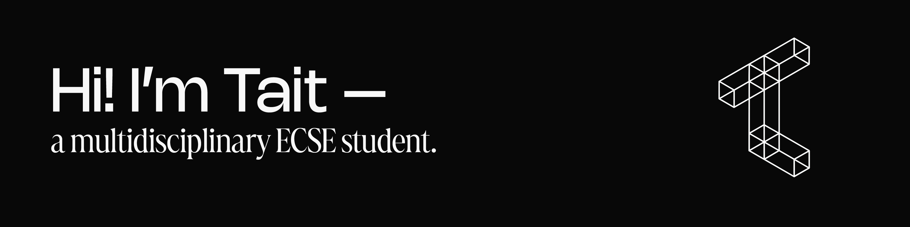

  

# ABOUT ME

I've been a photographer and videographer for over four years, and along the way, I came to appreciate the technology that I work with. From industry-standard post-production software to intricate camera sensor systems, there's plenty to understand, build, and experiment.

 

As Theo Jansen once said:

  <em>“The walls between art and engineering exist only in our minds.”</em> 

 

This is where that notion comes to life. From the hardware and tools that make my shooting process easier, to custom design tools and plugins that enables me to become experimental with my work, turning photos and videos into art pieces. You can check out what I've been up to down below. 

 

Interested? Follow along for the journey.

  <a href="https://studiooftait.mypixieset.com/">Website</a> ·
  <a href="https://www.linkedin.com/in/taitleong/">LinkedIn</a> ·
  <a href="https://medium.com/@taitl">Medium</a> ·
  <a href="https://instagram.com/taaitl">Instagram</a> ·
  <a href="https://www.flickr.com/people/taitl/">Flickr</a>

 

  「 认真生活的人都在一门心思搞艺术 」

 

# CURRENTLY WORKING
1. 

 

# RECENT PROJECTS
1. 
